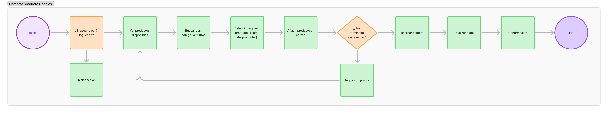

# DIU25
Prácticas Diseño Interfaces de Usuario (Tema: Gastronomía/ocio de degustación ) 

[Guiones de prácticas](GuionesPracticas/)

Grupo: DIU2.AGD.  Curso: 2024/25 

Actualizado: 07/03/2025

Proyecto: 

**Aliño**

Descripción: 

Aliño nace para ofrecer experiencias culinarias basadas en una cocina consciente, saludable y accesible. A través de talleres con ingredientes de cercanía y un entorno inclusivo, buscamos conectar a personas con la cultura local desde el sabor, fomentando una relación más ética con los alimentos y el entorno.
Se trata de un centro de talleres gastronómicos donde se aprende a cocinar con productos locales, frescos y saludables.
Una propuesta que une sabor, bienestar y sostenibilidad.

Logotipo: 

_Sabor local, cocina consciente_

Miembros:
 * :bust_in_silhouette:  Ana Graciani Donaire     :octocat:     [agd03](https://github.com/agd03)

----- 

# Proceso de Diseño 

 

## Paso 1. UX User & Desk Research & Analisis 

### 1.a User Reseach Plan
 
-----

[Granada Cooking](https://granadacooking.com/) ofrece talleres de cocina en Granada, dirigidos a turistas y locales interesados en experiencias gastronómicas. No tenemos experiencia previa en este tipo de actividades, por lo que analizaremos la web desde la perspectiva de nuevos usuarios.

Comenzaremos con una visita al establecimiento para comprobar si la ubicación es fácil de encontrar, evaluar el contacto con el negocio y contrastar la información real con la que aparece en la web. Luego, realizaremos un estudio de usabilidad con personas interesadas en la gastronomía que no hayan utilizado antes la web.

El estudio incluirá:

- Pruebas de usuario, en las que los participantes explorarán la web y realizarán tareas como consultar talleres o simular una reserva.
- Entrevistas, para conocer su opinión sobre facilidad de uso y claridad de la información.
- Encuestas, donde valorarán aspectos como navegación, accesibilidad y proceso de reserva.

El objetivo es identificar mejoras para que la web refleje mejor la experiencia real y optimizar la usabilidad.

### 1.b Competitive Analysis
 
-----

[Ver Análisis de Competencia](P1/CompetitorAnalysis.pdf)

**Granada Cooking** se sitúa en un **punto intermedio dentro de su sector**, ofreciendo una propuesta atractiva pero con ciertas limitaciones en comparación con sus competidores. Destaca por su asistencia en tiempo real y la posibilidad de realizar reservas online, lo que la hace accesible y funcional en términos de interacción con los usuarios. Sin embargo, presenta debilidades notables, como la falta de soporte en varios idiomas, lo que puede limitar su alcance a un público más amplio, y la ausencia de un servicio de newsletter que ayude a mantener el interés de sus clientes.

En comparación con **Taller Andaluz de Cocina**, Granada Cooking ofrece una navegación aceptable y asistencia en tiempo real, lo que facilita la interacción con los usuarios. Sin embargo, Taller Andaluz de Cocina proporciona una experiencia más estructurada y en dos idiomas (español e inglés), lo que le da ventaja en accesibilidad para turistas y público extranjero. Además, la navegación en su web es más clara, aunque su diseño sigue siendo algo complejo​CompetitorAnalysis.

Por otro lado, **Food Romance Company** sobresale en facilidad de uso y accesibilidad. Su navegación es la más intuitiva de las tres y su proceso de reserva está mejor optimizado. También ofrece una mayor variedad de cursos y la información está mejor organizada, lo que facilita la toma de decisiones de los usuarios. Granada Cooking, en cambio, tiene problemas con la visualización del calendario, que requiere demasiado desplazamiento y no siempre muestra fechas disponibles de forma clara​CompetitorAnalysis.

Para mejorar su competitividad, Granada Cooking debería trabajar en tres aspectos clave:

- Hacer su web más intuitiva, especialmente el sistema de reservas, que actualmente puede resultar confuso.

- Mejorar la accesibilidad, incluyendo más idiomas para atraer a clientes internacionales.

- Fortalecer la relación con los usuarios, por ejemplo, con una newsletter que informe sobre nuevos cursos y eventos.

En general, Granada Cooking tiene potencial, pero necesita optimizar su usabilidad y comunicación para estar al nivel de sus competidores.

### 1.c Personas
 
-----

**Marta González Carrasco** es una diseñadora gráfica freelance de 34 años, apasionada por el arte, la gastronomía y los viajes culturales. Busca experiencias que combinen creatividad y cocina, disfrutando de descubrir nuevas culturas a través de la comida. Comparte su aprendizaje en redes y se inspira en cada experiencia para su trabajo artístico.

**Sophie Dupont** es una mujer francesa de 65 años, bibliotecaria jubilada, que ha venido a pasar unos meses en Granada para estar cerca de su hija. Le apasiona la cocina casera y saludable, y busca actividades culturales que le permitan conocer la gastronomía local y hacer nuevas amistades. Aunque no habla español y su nivel de inglés es básico, está abierta a nuevas experiencias. Valora sentirse bienvenida y poder participar sin que el idioma sea una barrera, disfrutando de su estancia mientras aprende sobre la cultura y comparte momentos con otras personas.

### 1.d User Journey Map
 
----

[Ver User Jouney Map #1 (Marta)](P1/Persona&UserJourneyMap1.pdf)

**Marta** busca un curso de cocina en Granada y encuentra la web de Granada Cooking, que le parece **atractiva**. Pero después se da cuenta de que los **talleres** en la página de inicio están **desactualizados**. Al intentar reservar uno actual, el listado no tiene imágenes, haciéndolo menos atractivo. Cuando intenta reservar el sistema no muestra fechas disponibles ni explica por qué no puede hacerlo. **Frustrada, abandona la web** y busca otra opción.

Este caso muestra cómo una web con buen diseño inicial puede perder usuarios por problemas de usabilidad y contenido desactualizado. La falta de información clara sobre la disponibilidad de talleres y la ausencia de imágenes reducen el atractivo y generan confusión. Esto es común en plataformas que no priorizan la actualización de su contenido ni optimizan su sistema de reservas.

Los principales **problemas** detectados son:

- Información desactualizada, que genera desconfianza.

- Falta de imágenes, lo que hace menos atractiva la experiencia de exploración.

- Sistema de reservas poco claro, sin indicaciones sobre disponibilidad ni errores.

Por lo que proponemos las siguientes **mejoras**:

- Actualizar la información periódicamente.

- Añadir imágenes atractivas en los listados de talleres.

- Optimizar el sistema de reservas, mostrando disponibilidad y mensajes claros.

En general, Granada Cooking ofrece una propuesta interesante, pero necesita mejorar su usabilidad y gestión de contenido para evitar la pérdida de clientes potenciales.

[Ver User Jouney Map #2 (Sophie)](P1/Persona&UserJourneyMap2.pdf)

**Sophie** está pasando unos meses en Granada y busca un taller de cocina para conocer gente. Encuentra la web de Granada Cooking, que le parece interesante al principio y le parece que el local está **bien situado**, pero pronto se enfrenta a **barreras idiomáticas**: la web solo está en español y no ofrece una opción clara para cambiar de idioma. Aunque usa el traductor del navegador, la experiencia no es fluida. Al acceder al listado de talleres, no encuentra imágenes ni explicaciones claras, lo que le genera **inseguridad**. Finalmente, abandona la página y descarta apuntarse.

Este caso evidencia cómo una web que parece atractiva en un primer vistazo puede frustrar al usuario si no está adaptada a sus necesidades básicas. Sophie representa un perfil habitual en este tipo de actividades: personas mayores, extranjeras, con ganas de integrarse pero con limitaciones idiomáticas. Su experiencia muestra que una barrera tan simple como el idioma puede hacer que el usuario descarte una opción con gran potencial.

Los principales **problemas** detectados son:

- Falta de opción multilingüe integrada en la web.

- Listado de talleres sin imágenes ni explicaciones claras.

- Traducción automática poco fiable y fragmentada.

- Dificultad para navegar por la web sin conocimientos de español.
 
  
Por lo que proponemos las siguientes **mejoras**:

- Incluir versión de la web en varios idiomas, al menos inglés como idioma secundario.

- Añadir imágenes atractivas y explicaciones sencillas en el listado de talleres.

- Rediseñar la navegación para que sea más intuitiva y visual.

- Mostrar de forma explícita si el taller es apto para personas extranjeras o si cuenta con apoyo lingüístico.
  
En resumen, Granada Cooking tiene potencial para atraer a usuarios internacionales y está bien situado, pero necesita adaptar su web para ofrecer una experiencia más inclusiva, especialmente para personas mayores o con barreras idiomáticas.

### 1.e Usability Review
 
----

[Ver Usability Review](P1/Usability-review.pdf)

Puntuación obtenida: **59/100** (moderado)

Granada Cooking ofrece una web atractiva y bien estructurada, con buena presencia en buscadores y asistencia en tiempo real a través de WhatsApp y formulario de contacto. Pero también presenta fallos que afectan la experiencia de usuario, especialmente en la navegación y el proceso de reserva.

**Puntos fuertes:**

- Diseño visual limpio y con buena legibilidad.

- Contacto directo por WhatsApp, lo que facilita la comunicación.

- Fácil de encontrar en Google.

**Puntos débiles:**

- La página de inicio muestra talleres desactualizados, lo que genera confusión y desconfianza.

- El sistema de reservas es poco intuitivo y no informa sobre la disponibilidad de plazas.

- Falta de filtros y opciones de búsqueda para encontrar talleres fácilmente.

- Algunas secciones tienen tiempos de carga lentos, lo que puede desmotivar a los usuarios.

- No existe opción de cambio de idioma, haciendo la web inaccesible para no hispanoparlantes.

**Conclusión:**
Aunque la web tiene una buena base, necesita mejorar la usabilidad del sistema de reservas, actualizar su contenido con más frecuencia, optimizar la navegación y añadir versiones en otros idiomas. Resolver estos problemas evitaría la frustración de los usuarios y ayudaría a aumentar las reservas y la fidelización de clientes.

 

## Paso 2. UX Design  

### 2.a Reframing / IDEACION: Empathy map 
 
----

- [Ver Empathy Map](P2/EmpathyMap.pdf)

Tras analizar los perfiles de Marta y Sophie en el mapa de empatía, hemos detectado algunas diferencias importantes en cómo cada una vive o se imagina la experiencia de asistir a un taller de cocina. Marta valora mucho el diseño, lo visual y los contenidos relacionados con la cocina saludable. Sophie, en cambio, se mueve más por el componente social y busca sentirse incluida, sobre todo teniendo en cuenta la barrera del idioma y la edad.

Aunque la competencia (en este caso Granada Cooking) ofrece una propuesta interesante, y cuenta con elementos como valoraciones de usuarios, hay aspectos que no termina de cubrir del todo: la navegación no está adaptada a personas que no hablan español, no hay posibilidad de filtrar talleres por idioma o nivel, y visualmente podría ser más clara y llamativa. Esto hace que ciertas personas se sientan algo inseguras a la hora de reservar, o incluso que no lleguen a hacerlo.

A raíz de esto, nos planteamos cómo podría ser una web más accesible, inclusiva y cercana, y nos surgen algunas preguntas. ¿Y si no solo mostramos talleres, sino también la historia detrás de cada ingrediente y cada productor? ¿Y si hubiera más opciones para adaptar la experiencia a distintos perfiles, sin complicarla?

Aliño nace con esa idea: crear una plataforma web clara, visual y accesible donde cualquier persona —local o extranjera— pueda descubrir y reservar talleres de cocina saludables, conectando con productores locales y compartiendo la experiencia con otras personas. Nuestra propuesta de valor se centra en esa conexión: entre personas, con el territorio y con los ingredientes.

### 2.b ScopeCanvas

----

- [Ver Scope Canvas](P2/ScopeCanvas.pdf)

Aliño propone una experiencia gastronómica accesible, consciente y conectada con el entorno local. A través de talleres de cocina con productos de proximidad, buscamos crear una comunidad en torno a la alimentación saludable, visibilizar a los productores y facilitar la participación de todo tipo de usuarios, sin barreras de idioma o nivel. Nuestro objetivo es rediseñar la experiencia digital para que sea clara, multilingüe y usable, potenciando tanto la reserva de talleres como la compra de productos asociados.

### 2.b User Flow (task) analysis 
 
-----

Para el análisis de tareas se ha creado una **User/Task Matrix**, una herramienta de diseño centrado en el usuario que sirve para cruzar los diferentes tipos de usuarios de una interfaz con las tareas que pueden realizar dentro de ella. Nos ayuda a identificar qué acciones son más relevantes o frecuentes para cada perfil, y con ello, priorizar el diseño de pantallas, funcionalidades y contenidos. En el caso de Aliño, la matriz nos ha permitido comparar las necesidades de Marta, Sophie y los proveedores locales, y tomar decisiones de diseño más informadas y adaptadas a sus diferencias.

- [Ver User/Task Matrix](P2/UserTask_Matrix.pdf)

A partir de la User/Task Matrix, se han definido tres recorridos principales que cubren las tareas más representativas. Estos flujos nos permiten visualizar paso a paso cómo interactúan los usuarios con la aplicación, y nos ayudan a validar que el diseño propuesto responde a sus necesidades de forma clara, eficiente y accesible.

**Reservar taller**

- [Ver TaskFlow de "Reservar taller"](P2/TaskFlow1.png)

**Comprar producto**

- [Ver TaskFlow de "Comprar producto"](P2/TaskFlow2.png)

**Proponer producto**

- [Ver TaskFlow de "Proponer producto"](P2/TaskFlow3.png)

### 2.c IA: Sitemap + Labelling 
 
----

Para organizar bien la navegación de la web y facilitar la comprensión de los contenidos, hemos trabajado la arquitectura de la información desde dos enfoques: el sitemap y el labelling.

**Sitemap**

- [Ver Sitemap](P2/Sitemap.pdf)

El sitemap es un esquema visual que muestra cómo se estructura la web: qué páginas existen, cómo se relacionan entre sí y qué elementos son comunes en toda la plataforma (como el navbar o el footer). Nos ayuda a tener una visión global de la navegación y a asegurarnos de que todo está bien conectado. Para crearlo hemos utilizado la herramienta [FlowMapp](https://www.flowmapp.com/), que nos ha permitido construirlo de forma clara, ordenada y visual.

**Labelling**

Por otro lado, el labelling consiste en definir con cuidado los nombres que daremos a cada sección o elemento del sitio. Se han evitado tecnicismos y anglicismos innecesarios, usando etiquetas sencillas y comprensibles por cualquier tipo de usuario. Cada término va acompañado de una pequeña explicación sobre su función, lo que también nos ayuda a mantener consistencia en el diseño y preparar la web para una futura versión multilingüe.

- [Ver Labelling](P2/Labelling.pdf)

Gracias a este trabajo previo, ahora tenemos una base sólida para el diseño de menús, botones y rutas de navegación. Todo está pensado para que el usuario, ya sea local o extranjero, se mueva por la web de forma intuitiva y sin obstáculos.

### 2.d Wireframes
 
-----

Como parte del proceso de diseño centrado en el usuario, se han creado varios wireframes en baja fidelidad (Lo-Fi) que simulan la estructura visual de las pantallas principales de la web. Estos bocetos permiten definir la jerarquía de los elementos, probar ideas de distribución y validar la funcionalidad sin distraernos con detalles estéticos o visuales.

Primero se realizaron los bocetos a mano, en iPad en mi caso, como paso inicial para organizar contenidos y explorar distintas opciones de layout. Posteriormente, estas ideas se trasladaron a Figma, utilizando la plantilla de "Website Wireframe" disponible en la comunidad. Esto nos permite mantener un diseño limpio, reutilizable y coherente entre pantallas.

Los wireframes representan las vistas más importantes del sitio: la homepage, las dos formas de explorar los talleres (en lista y en calendario), y la ficha de taller. Cada una de ellas ha sido pensada para responder a las necesidades detectadas en el empathy map y la User Task Matrix, manteniendo siempre el foco en la claridad, la accesibilidad y la facilidad de navegación.

- [Ver Borradores](P2/Borradores.pdf)

**HomePage**

**Talleres (vista de lista)**

**Talleres (vista de calendario)**

**Ficha de taller**

 

## Paso 3. Mi UX-Case Study (diseño)

En esta práctica desarrollamos el prototipo Hi-Fi de la app Aliño, adaptado a móvil. A partir de los bocetos anteriores, se definió la guía visual, se aplicaron patrones de diseño basados en Material Design y se construyó un prototipo interactivo en Figma que simula la experiencia del usuario final.

### 3.a Moodboard

-----

El moodboard de _Aliño_ recoge los principales elementos visuales del proyecto: logotipo, paleta de colores, tipografía, imágenes de inspiración y perfil de usuario. El logotipo fue creado con [Logoponi](https://logoponi.es/) y las imágenes de marca se seleccionaron desde [Pinterest](https://es.pinterest.com/) para reflejar un estilo natural, fresco y cercano. Se ha utilizado la plantilla disponible en el espacio de la asignatura en Figma, lo que ha permitido estructurar de forma clara y coherente los elementos visuales.
La resolución está pensada para entorno digital, ideal para presentaciones o prototipos. Para redes sociales como Instagram, sería necesario adaptar el formato a una versión más vertical o cuadrada con foco visual.

### 3.b Landing Page
 
----

La landing page de Aliño sigue el estilo definido en el moodboard, con una estética natural, cercana y luminosa. Utiliza la paleta de verdes, tipografía limpia e imágenes inspiradoras que refuerzan el mensaje principal: “Sabor local, cocina consciente”. Incluye un carrusel visual, beneficios clave del proyecto y una llamada a la acción clara: “¡Explora nuestros talleres!”.

### 3.c Guidelines
 
----

Esta sección recoge los principales **patrones de diseño de interfaz (UI Patterns)** y **guías visuales (guidelines)** aplicadas en el desarrollo del prototipo móvil de **Aliño**, basadas en las recomendaciones de [Material Design 3](https://m3.material.io/) y adaptadas al estilo visual definido en el proyecto.

#### UI Guidelines (Versión móvil)

**Referencias y recursos base**

- Google Material Design (Material 3): https://m3.material.io/
- Kit de diseño Material 3 para Figma: [Figma Community](https://www.figma.com/community/file/1035203688168086460/material-3-design-kit)
- UXPin Web UI Design Patterns Vol. 1: https://www.uxpin.com/studio/ebooks/web-ui-design-patterns-2016-volume-1/

**Principios generales de diseño**

- Consistencia visual: Uso de una paleta cromática definida, jerarquía clara de textos y componentes coherentes.
- Diseño accesible: Contrastes adecuados, tipografía legible, botones accesibles.
- Mobile-first: Diseño completamente adaptado a dispositivos móviles.
- Interacción centrada en el usuario: Flujo intuitivo, patrones reconocibles y procesos guiados.

**Paleta de colores (branding)**

- Verde principal: `#00E04F`
- Verde menta claro: `#ADFFB6`
- Blanco: `#FFFFFF`
- Gris claro: `#D6D6D6`
- Gris oscuro: `#3D3D3D`

**Patrones UI aplicados**

1. **Onboarding**
   - Explicación inicial del propósito de Aliño.
   - Introducción a la cocina consciente y talleres locales.

2. **Menú (NavBar adaptada a móvil)**
   - Menú inferior persistente con secciones: *Talleres*, *Productos*, *Sobre Aliño*, *Colabora*, *Idioma*.

3. **Hero image + Carousel**
   - Imagen destacada con eslogan: *Sabor local, cocina consciente*.
   - Carrusel de productos o talleres destacados.

4. **Search**
   - Campo de búsqueda en la sección de talleres/productos.
   - Filtro por categoría, nivel o disponibilidad.

5. **Wizards (explicación de proceso)**
   - Pasos visuales para completar una reserva de taller.
   - Proceso guiado para finalizar la compra.

6. **Article List (5–7 cards)**
   - Tarjetas con imágenes, nombre, origen y precio de productos locales.
   - Lista de talleres con fecha, nivel y botón de reserva.

7. **Item details + actions**
   - Página de detalle para talleres y productos.
   - Información detallada y CTA (comprar / reservar).

8. **Reserva**
   - Calendario interactivo para seleccionar fechas de talleres.
   - Confirmación con resumen y datos del evento.

9. **Form Input**
   - Formularios accesibles con campos bien espaciados y etiquetas claras.

10. **Shopping Cart**
    - Vista de productos seleccionados.
    - Total y botón de pago/reserva.

11. **About**
    - Sección *Sobre nosotros* con misión y valores de Aliño.
    - Información de contacto y mapa.

**Elementos opcionales incluidos**

- **Calendario de eventos**
  - Selección por día desde un calendario mensual adaptado a móvil.
  
- **Etiquetas y categorías**
  - Filtros visuales para explorar por tipo de taller, nivel o idioma.

Los elementos y patrones descritos se desarrollarán visualmente a continuación, usando componentes del sistema Material 3 adaptados al estilo y necesidades del proyecto Aliño.

### 3.d Mockup
 
----

- [Ver Prototipo](https://www.figma.com/proto/S7slxbfggiDGoF8RZyuARQ/Hi-FI_P3?node-id=33-305&t=ItcOqESpfAJquXVv-1)
  
El layout Hi-Fi de Aliño presenta una interfaz móvil intuitiva y visualmente coherente, centrada en la promoción de talleres gastronómicos y productos locales. Utilizando herramientas de [Material 3 Design Kit](https://www.figma.com/community/file/1035203688168086460), combina una navegación clara, tarjetas visuales y una estética fresca y accesible que refleja los valores del proyecto: cocina consciente, cercanía y sostenibilidad.

 

## Paso 4. Pruebas de Evaluación 

### 4.a Reclutamiento de usuarios 

-----

El caso B corresponde al rediseño web del café-bar **La Goma**, un espacio vegano y cultural ubicado en Granada. El objetivo del proyecto es facilitar la comunicación entre el local y sus clientes, permitiendo consultar el menú, conocer las actividades culturales programadas, y realizar reservas de forma sencilla desde una página web atractiva y accesible.

La propuesta se inspira en valores como la sostenibilidad, la alimentación consciente y la apertura cultural. Estos conceptos se reflejan en el diseño visual mediante una paleta de colores tierra, tipografía legible y un enfoque visual natural. Entre las secciones clave de la web se encuentran: **inicio con calendario, menú detallado, actividades, formulario de reserva, reseñas** y un apartado sobre el local.

- [Repositorio del caso B (La Goma)](https://github.com/lunaanelia/DIU_UX_CaseStudy/tree/master)
- [Prototipo](https://www.figma.com/proto/6JI75VXxkkAEUZxOk010fu/La-Goma.com-by-DIU1.AlexMarcos?node-id=2438-4469&p=f&t=hIAQcQax5B8Qg20q-0&scaling=scale-down&content-scaling=fixed&page-id=0%3A1&starting-point-node-id=473%3A768)

#### Usuarios de muestra para tests

| Usuarios | Sexo/Edad     | Ocupación   |  Exp.TIC    | Personalidad | Plataforma | Caso | Posibles situaciones conflictivas
| ------------- | -------- | ----------- | ----------- | -----------  | ---------- | ---- | -----------------------------
| U1 - Paula  | M / 22   | Estudiante  | Alta       | Introvertido | móvil       | A | Puede perderse si la interfaz es confusa o sobrecargada.
| U2 - Pablo  | H / 21   | Estudiante  | Alta       | Extrovertido       | móvil        | B | Puede saltarse pasos o no fijarse en los detalles.
| U3 - Andrés  | H / 20   | Estudiante     | Alta        | Extrovertida    | móvil      | B | Se impacienta si el flujo es largo o poco claro.
| U4 - Manuel  | H / 22   | Estudiante  | Baja       | Racional     | móvil        | B | Necesita estructura lógica; confusión si no hay jerarquía clara.

### 4.b Diseño de las pruebas 
 
-----

Se ha planificado un conjunto de pruebas para evaluar la usabilidad y eficacia de los prototipos correspondientes a los casos A (Aliño) y B (La Goma), utilizando técnicas comunes en investigación UX. Las pruebas se han desarrollado de forma remota, a través de [Maze](https://maze.co/) y [Gaze Recorder](https://app.gazerecorder.com/) (una herramienta de eye tracking).

Aunque no se aplicó formalmente el checklist de la P1, se tuvieron en cuenta varios de sus principios (visibilidad, control del usuario, consistencia, prevención de errores) al observar los comportamientos y recopilar comentarios de los usuarios.

#### 1. A/B Testing (Maze)

Se diseñaron dos tests paralelos en Maze, uno para cada prototipo, asignando 2 usuarios a cada caso.

Se diseñaron dos tests de usabilidad, uno para el caso A (Aliño) y otro para el caso B (La Goma), con tareas equivalentes que permiten comparar la experiencia del usuario en ambos prototipos.

Ambos tests serán ejecutados por 2 usuarios cada uno. Las métricas obtenidas incluyen:
- Nivel de confianza de navegación (CONFIDENCE: Level 0)
- Tasa de éxito por tarea
- Respuestas a escalas de opinión
- Comentarios cualitativos

Estas pruebas permitieron observar diferencias en la claridad de los flujos, organización de la información y diseño visual entre los casos A y B.

#### 2. Test SUS (System Usability Scale)

Al finalizar cada test en Maze, se incluyó un bloque con las 10 preguntas del cuestionario SUS, adaptadas a un lenguaje comprensible para los usuarios.

Con esto se obtuvo una puntuación de percepción de usabilidad por usuario, lo que permite comparar la experiencia general entre ambos prototipos.

#### 3. Eye Tracking

Cada usuario fue expuesto durante 20 segundos a la pantalla de inicio del prototipo que le correspondía (A o B), usando la herramienta Gaze Recorder. Las pruebas fueron de tipo exploración libre, con la siguiente instrucción:

> “Observa la pantalla como si estuvieras usando una app nueva.”

A partir de las grabaciones se generaron mapas de calor para cada usuario, lo que permitió identificar qué zonas de la interfaz llamaban más la atención (áreas de interés) y cuáles pasaban desapercibidas. Esto ayudó a detectar diferencias entre lo que el diseño intentaba destacar y lo que realmente percibían los usuarios.

### 4.c Cuestionario SUS
 
----

>>> Como uno de los test para la prueba A/B testing, usaremos el **Cuestionario SUS** que permite valorar la satisfacción de cada usuario con el diseño utilizado (casos A o B). Para calcular la valoración numérica y la etiqueta linguistica resultante usamos la [hoja de cálculo](https://github.com/mgea/DIU19/blob/master/Cuestionario%20SUS%20DIU.xlsx). Previamente conozca en qué consiste la escala SUS y cómo se interpretan sus resultados
http://usabilitygeek.com/how-to-use-the-system-usability-scale-sus-to-evaluate-the-usability-of-your-website/)
Para más información, consultar aquí sobre la [metodología SUS](https://cui.unige.ch/isi/icle-wiki/_media/ipm:test-suschapt.pdf)
>>> Adjuntar en la carpeta P4/ el excel resultante y describa aquí la valoración personal de los resultados

|   |   |   |   |   |   |
|---|---|---|---|---|---|
||PREGUNTAS|U1|U2|U3|U4|
|1|Creo que me gustará visitar con frecuencia este website|5|4|3|2|
|2|Encontré el website innecesariamente complejo|1|2|1|1|
|3|Pensé que era fácil utilizar este website|5|5|4|5|
|4|Creo que necesitaría del apoyo de un experto para recorrer el website|1|1|1|1|
|5|Encontré las funciones del website bastante bien integradas|4|2|3|2|
|6|Pensé que había demasiada inconsistencia en el website|1|1|1|2|
|7|Imagino que la mayoría de las personas aprenderían muy rápidamente a utilizar el website|5|4|4|2|
|8|Encontré el website muy grande al recorrerlo|1|2|1|1|
|9|Me sentí muy confiado en el manejo del website|4|5|4|5|
|10|Necesito aprender muchas cosas antes de manejarse en el website|1|1|1|4|

### 4.d A/B Testing
 
-----

#### Test A – Aliño

**Tareas:**
1. Acceder a la vista en calendario de los talleres disponibles.
2. Encontrar el mapa que muestra nuestra localización.
3. Explorar libremente la aplicación.

**Feedback recogido:**
- Opinión general media: **5/6**
- Facilidad para encontrar lo buscado, aunque el mapa no fue fácil de localizar de inmediato.
- Buena valoración estética y percepción de claridad.

[Enlace al test](https://t.maze.co/391288018?guerilla=true)
[Enlace a los resultados](https://app.maze.co/report/testAlinyo/3mean7mbb0c9c3/intro)

----

#### Test B – La Goma

**Tareas:**
1. Acceder al calendario para fijar tu actividad.
2. Consultar las reseñas de usuarios anteriores.
3. Explorar la aplicación libremente.

**Feedback recogido:**
- Opinión general media: **4.5/6**
- Facilidad para encontrar lo buscado, pero encontrar las reseñas fue menos intuitivo.
- Diseño valorado positivamente, aunque algo más cargado visualmente.

* No se incluye enlace directo al test ni a los resultados porque tuvo que realizarse de forma offline por problemas con la plataforma Maze.
  
----

>>> Los resultados de un A/B testing con 3 pruebas y 2 casos o alternativas daría como resultado una tabla de 3 filas y 2 columnas, además de un resultado agregado global. Especifique con claridad el resultado: qué caso es más usable, A o B?

### 4.e Aplicación del método Eye Tracking 

----

>>> Indica cómo se diseña el experimento y se reclutan los usuarios. Explica la herramienta / uso de gazerecorder.com u otra similar. Aplíquese únicamente al caso B.

  
>>> Cambiar esta img por una de vuestro experimento. El recurso deberá estar subido a la carpeta P4/  

>>> gazerecorder en versión de pruebas puede estar limitada a 3 usuarios para generar mapa de calor (crédito > 0 para que funcione) 

### 4.f Usability Report de B
 
-----

>>> Añadir report de usabilidad para práctica B (la de los compañeros) aportando resultados y valoración de cada debilidad de usabilidad. 
>>> Enlazar aqui con el archivo subido a P4/ que indica qué equipo evalua a qué otro equipo.

>>> Complementad el Case Study en su Paso 4 con una Valoración personal del equipo sobre esta tarea

 

## Paso 5. Exportación y Documentación 

### 5.a Exportación a HTML/React
 
----

>>> Breve descripción de esta tarea. Las evidencias de este paso quedan subidas a P5/

### 5.b Documentación con Storybook

----

>>> Breve descripción de esta tarea. Las evidencias de este paso quedan subidas a P5/

 

## Conclusiones finales & Valoración de las prácticas

>>> Opinión FINAL del proceso de desarrollo de diseño siguiendo metodología UX y valoración (positiva /negativa) de los resultados obtenidos. ¿Qué se puede mejorar? Recuerda que este tipo de texto se debe eliminar del template que se os proporciona 

