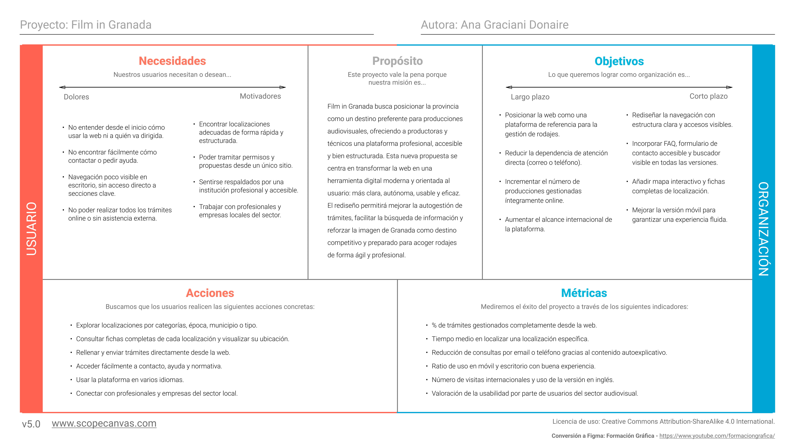

# Trabajo Final: Portfolio UX y resolución de un supuesto práctico
Diseño Interfaces de Usuario - Universidad de Granada

Ana Graciani Donaire

Curso: 2024/25 

## Índice

- [Objetivos](#objetivos)
- [Parte I: Mi experiencia UX](#parte-i-mi-experiencia-ux)
  - [Actividades de clase](#actividades-de-clase)
  - [Prácticas](#prácticas) 
- [Parte II: Caso de estudio](#parte-ii-caso-de-estudio)
  - [Introducción](#introducción)
  - [1. Análisis de la web](#1-análisis-de-la-web)
  - [2. Comparativa con otra propuesta](#2-comparativa-con-otra-propuesta)
  - [3. Propuesta de valor](#3-propuesta-de-valor)
  - [4. Análisis final](#4-análisis-final)
- [Conclusión](#conclusión)

## Objetivos

El objetivo de este trabajo final es poner en práctica los conocimientos adquiridos en la asignatura de Diseño de Interfaces de Usuario a través de dos enfoques complementarios. Por un lado, se incluye un portfolio personal que recoge las aportaciones más relevantes realizadas durante el curso, con una valoración reflexiva sobre la experiencia y el aprendizaje en el ámbito de la UX/UI. Por otro, se desarrolla un caso práctico basado en el análisis y rediseño de una página web real de una film commission, con el propósito de mejorar su usabilidad, accesibilidad, estructura de la información y experiencia de usuario. Con esta combinación, se busca conectar la teoría con la práctica, aplicando metodologías y principios de diseño centrado en el usuario de forma justificada y coherente.

# PARTE I: MI EXPERIENCIA UX

## Actividades de clase

A lo largo del curso he tenido la oportunidad de aplicar diferentes técnicas y enfoques del diseño centrado en el usuario a través de actividades prácticas. A continuación, destaco aquellas en las que mi aportación fue más significativa y que considero clave en mi aprendizaje en UX/UI.

### Actividad 1: Etnografía

La observación etnográfica en una parada de autobús me permitió identificar barreras reales en la experiencia del usuario, como la falta de información clara o la presión del tiempo en la toma de decisiones. Confirmé el valor de la etnografía como técnica de UX Research, especialmente en fases tempranas del diseño, y aprendí a relacionar la observación contextual con criterios de usabilidad.

**Valoración:** Apliqué la técnica con rigor, obtuve insights relevantes y fui capaz de relacionar la observación con el diseño contextualizado. Considero que la calidad de mi trabajo en esta actividad fue alta.

### Actividad 3: Moodboard

Participé en la conceptualización visual de *El foco de Granada*, un espacio cultural ficticio. Aprendí a traducir valores emocionales como la transformación y la creatividad en decisiones visuales coherentes, como la elección de una paleta cromática y un logotipo simbólico. Esta actividad me ayudó a entender cómo lo narrativo y lo visual se integran desde las fases iniciales del diseño.

**Valoración:** Creo que fue una de mis contribuciones más completas. Me sentí muy cómoda en el grupo de trabajo y supimos unir lo conceptual con lo visual, aportando una dirección clara al proyecto. Fue un trabajo cuidado y coherente desde lo emocional y lo narrativo.

### Actividad 4: Accesibilidad

Evaluamos la web del Ayuntamiento de Toledo con herramientas como WAVE y simuladores de discapacidad. Identificamos carencias clave en accesibilidad y propusimos mejoras alineadas con las WCAG. Esta actividad reforzó en mí una mirada más empática e inclusiva hacia el diseño, entendiendo la accesibilidad como una responsabilidad ética.

**Valoración:** Fue un trabajo equilibrado en el que destaqué por mi implicación en la reflexión final, especialmente al identificar limitaciones reales de ciertos colectivos. Considero muy valioso el aprendizaje de esta actividad.

## Prácticas

A continuación mencionaré las herramientas utilizadas y aportaciones que considero más destacables de cada una de las prácticas realizadas en la asignatura.

### Paso 1: UX User & Desk Research & Analisis

Esta práctica supuso un cambio en mi forma de analizar interfaces: fue mi primer contacto real con herramientas de investigación UX y aprendí a observar la web desde la perspectiva de un nuevo usuario, no como desarrollador.

El **análisis competitivo** fue el punto de partida. Comparar la web de *Granada Cooking* con otras similares me permitió ver cómo ciertos problemas —como la falta de multilingüismo, la navegación poco clara o la visualización del calendario— ya estaban mejor resueltos en otros casos. Entendí que investigar cómo lo hacen otros también forma parte del diseño UX, y ayuda a identificar estándares y oportunidades de mejora.

Después, crear los **User Journey Maps** de Marta y Sophie me ayudó a entender cómo esos fallos afectan directamente a la experiencia del usuario. Me permitió ver cómo un usuario puede sentirse perdido si no sabe dónde buscar la información que necesita. Esa falta de orientación genera frustración, y me hizo ver lo importante que es diseñar de forma clara y centrada en el usuario. Este ejercicio me ayudó a tomar una perspectiva mucho más cercana al usuario real, y a entender que en diseño no se puede dar nada por sentado.

Por último quiero destacar la realización de una evaluación heurística utilizando el **Usability Review**, una plantilla de 45 criterios basada en principios de usabilidad. Analicé la web teniendo en cuenta los perfiles definidos, lo que me permitió justificar cada puntuación y proponer mejoras concretas, como incluir filtros, facilitar la navegación o añadir feedback en procesos clave.

### Paso 2: UX Design

En esta práctica pasé del análisis a la propuesta de diseño, centrando el trabajo en cómo resolver de forma coherente los problemas detectados en fases anteriores.

Lo primero que hice fue trabajar en la **propuesta de valor** utilizando la herramienta *Scope Canvas*. Me ayudó a estructurar las ideas de Aliño desde el inicio, pensando no solo en las funcionalidades, sino en qué tipo de experiencia quería ofrecer y a quién. Reformulé el servicio como una propuesta centrada en sostenibilidad, cultura local y accesibilidad, lo que me permitió tomar decisiones de diseño con un enfoque más claro y coherente. Me di cuenta de que una propuesta de valor bien definida no es solo una introducción, sino una guía práctica para todo el proceso de diseño.

Después, desarrollé una **matriz de tareas cruzada** para tres perfiles: Marta, Sophie y un proveedor local. Incluir al productor como usuario fue clave en mi propuesta, ya que en Aliño no es solo una figura externa, sino una parte activa del sistema. Este enfoque me obligó a tener en cuenta otras necesidades y flujos distintos a los del consumidor final, y me ayudó a diseñar una solución más completa y realista.

Por último, diseñé los primeros **wireframes** de la interfaz. Al principio me parecía muy complicado crear una web desde cero, pero al ponerme a ello resultó mucho más natural de lo que esperaba. Creo que fue gracias a haber analizado otras webs en la práctica anterior, y a tener como referencia los patrones de diseño y buenas prácticas vistas en clase. Además, los wireframes no fueron un ejercicio estético, sino una forma de dar respuesta a problemas reales: como la falta de estructura clara, las barreras idiomáticas o una navegación poco intuitiva. Me di cuenta de que **analizar otros diseños es una herramienta muy útil para adquirir criterio y mejorar el propio proceso de diseño**.

### Paso 3: Mi UX-Case Study (diseño)

En esta práctica desarrollé el prototipo de alta fidelidad de Aliño, adaptado a móvil. De todo el proceso, quiero destacar las siguientes aportaciones:

En primer lugar, la elaboración del **moodboard** fue una herramienta clave para definir una identidad visual coherente desde el inicio. Aunque sencilla, me permitió establecer con claridad el tono del proyecto —natural, cercano y accesible— y facilitó la toma de decisiones visuales posteriores. La selección cuidada de paleta de colores, tipografía, imágenes y estilo marcó una base sólida para todo el diseño.

También fue destacable la aplicación de **patrones de Material Design** y principios de diseño accesible. No me limité a seguir una plantilla, sino que seleccioné y adapté los componentes con criterio, teniendo en cuenta el contexto de uso, el tipo de usuario y los objetivos de cada sección. Esto me permitió construir una interfaz coherente, funcional y optimizada para móvil, alineada con los estándares actuales.

El desarrollo del **mockup interactivo en Figma** fue una de las partes más valiosas del proceso. Pude simular la experiencia de uso real, incluyendo navegación entre pantallas, exploración de contenido, formularios y acciones como cambiar el idioma o completar una reserva. El prototipo no solo fue útil para visualizar la solución, sino también para anticipar ajustes antes de testearlo con usuarios.

Sí que me resultó complejo pasar de un diseño lo-fi planteado para web a un hi-fi adaptado a móvil. Me encontré con decisiones de distribución, navegación y jerarquía que no se trasladaban directamente, y eso me hizo ver lo importante que es tener en cuenta desde el principio el dispositivo final en el que el usuario va a interactuar con la interfaz. Además, me habría gustado manejar con más soltura algunas de las herramientas y plugins vistos en clase, ya que con más práctica técnica podría haber construido un mockup más pulido.

Estas aportaciones fueron claves para transformar la propuesta conceptual en una experiencia de usuario coherente y testeable.

### Paso 4: Pruebas de Evaluación

Destaco, por un lado, la **interpretación comparativa de los resultados** de los test. Me sorprendió que Aliño, siendo más simple, obtuviera mejor valoración que La Goma, que tenía un prototipo más desarrollado. Esto me hizo reflexionar sobre la importancia del atractivo visual y la claridad en las primeras interacciones: en una interfaz que aún no está terminada, los usuarios tienden a preferir lo que les resulta más accesible y visualmente cuidado. También soy consciente de que la muestra de usuarios era muy pequeña (solo cuatro), así que los resultados no son concluyentes, pero sí ilustrativos.

Por otro lado, la **aplicación del eye tracking** fue clave para detectar que ciertos elementos esenciales —como los botones de reserva o el selector de fecha— pasaban desapercibidos. Esta técnica me permitió proponer mejoras concretas en jerarquía visual y comprobar el valor de observar el comportamiento real del usuario, más allá de lo que verbaliza.

# PARTE II: Caso de estudio:
# Evaluación de un film commission como atractivo turístico de GRX

## Introducción

Una *film commission* es una entidad que promueve un territorio como escenario de rodajes audiovisuales, sirviendo de enlace entre instituciones locales y productoras. Su función no se limita a facilitar trámites, sino que también genera un impacto económico al atraer inversiones, empleo y actividad en sectores como la hostelería o el transporte.

Además, tiene un valor cultural importante al proyectar la identidad visual de una ciudad y reforzar su imagen como destino turístico vinculado al cine.

Este trabajo analiza la experiencia de usuario y el diseño de una web real de *film commission*, identificando aciertos y áreas de mejora desde una perspectiva profesional de UX. A partir de ese análisis se propone un rediseño enfocado en mejorar la usabilidad y potenciar el turismo cinematográfico.

## 1. Análisis de la web

Para evaluar la web de la film comission de Granada, [Film in Granada](https://filmgranada.com/), se ha llevado a cabo un análisis centrado principalmente en la usabilidad, apoyado en tres enfoques: un User Research Plan teórico para definir el perfil del usuario y sus necesidades principales; un análisis heurístico mediante el *usability review template* de la asignatura; y una revisión observacional general de la experiencia en escritorio y móvil.

Adicionalmente, se proponen algunas líneas para una futura evaluación del diseño visual, tomando como referencia principios clave de [*Laws of UX*](https://lawsofux.com/) y dinámicas empáticas inspiradas en [*Cards for Humanity*](https://cardsforhumanity.frog.co/), con el objetivo de detectar oportunidades de mejora desde una perspectiva de diseño centrado en el usuario.

### User Research Plan

El análisis se centra en la web de la [Granada Film Commission](https://filmgranada.com/), una plataforma destinada a atraer producciones audiovisuales al territorio de la provincia andaluza. El sitio está dirigido principalmente a profesionales del sector (productores, localizadores, directores), aunque también puede interesar a instituciones locales o turistas culturales.

Dado que no se han realizado estudios previos con usuarios reales, el análisis se desarrollará desde el enfoque de un primer visitante profesional sin experiencia previa con la plataforma.

Para ello, se plantea un estudio teórico basado en:

- **Tareas típicas del usuario profesional**, como buscar localizaciones, contactar con la comisión o consultar servicios ofrecidos.
- **Heurísticas de usabilidad** (Nielsen), aplicadas mediante la plantilla de evaluación usada en la asignatura.
- **Simulación de navegación desde dispositivos móviles y escritorio**, evaluando accesibilidad, arquitectura de la información y experiencia general.

El objetivo es detectar barreras que dificulten el uso por parte del público objetivo y proponer mejoras alineadas con buenas prácticas UX.

### Usability Review

- [Ver Usability Review test](usability-review-GRANADA.pdf)

**Puntuación obtenida: 66/100** (moderada)

*Film in Granada* es una web visualmente atractiva y funcional, orientada a profesionales del sector audiovisual. Ofrece acceso a localizaciones, formularios y contacto institucional, pero presenta carencias en orientación al usuario, ayuda contextual y experiencia móvil.

**Puntos fuertes:**

- Diseño limpio y profesional, con buena jerarquía visual.
- Formularios completos y bien organizados.
- Contacto institucional visible (email, teléfono y horario).
- Búsqueda eficaz en escritorio, con resultados relevantes.
- Buen rendimiento técnico y compatibilidad entre navegadores.

**Puntos débiles:**

- Falta orientación inicial clara en la página de inicio.
- Menú hamburguesa oculto incluso en escritorio.
- No hay ayuda contextual ni preguntas frecuentes.
- Búsqueda no disponible en móvil; formularios comprimidos.

**Conclusión:**
La web cumple su función principal, pero mejorar la accesibilidad móvil, la orientación y el acompañamiento al usuario haría que la experiencia fuera más completa, accesible y profesional.

### Evaluación del diseño

Aunque este análisis se ha centrado principalmente en la usabilidad, sería recomendable complementar la evaluación con un análisis del diseño visual. Para ello, se podrían aplicar principios clave recogidos en [*Laws of UX*](https://lawsofux.com/), como la ley de Fitts (para valorar la accesibilidad de botones o enlaces), la ley de la carga cognitiva (para detectar elementos que sobrecargan al usuario) o el efecto estética-usabilidad (para entender cómo el diseño visual influye en la percepción de usabilidad). 

Además, podría usarse una carta de [*Cards for Humanity*](https://cardsforhumanity.frog.co/) como "Clara" o "Útil" para reflexionar brevemente sobre si la interfaz comunica bien su propósito y facilita la toma de decisiones. Este tipo de enfoque permitiría detectar mejoras visuales y estratégicas desde una perspectiva centrada en el usuario, sin necesidad de una evaluación extensa.

## 2. Comparativa con otra propuesta

Para valorar objetivamente la calidad del diseño y la organización de tareas de la web *Film in Granada*, se ha realizado una comparativa con otra web del mismo ámbito: la [Valencia Film Office](https://www.valenciafilmoffice.org/). 

La comparación se basa en los criterios de la plantilla *Competitor Analysis* utilizada en la asignatura, centrando la atención en aspectos como la arquitectura de la información, la navegación, el diseño responsive, la accesibilidad del contenido y el soporte al usuario. Esta estrategia permite identificar de forma clara las diferencias clave entre ambas propuestas desde una perspectiva de diseño centrado en el usuario.

| Categoría               |                                                   | Film in Granada | Valencia Film Office |
|-------------------------|---------------------------------------------------|-----------------|----------------------|
| **Business Model**      | Acceso a trámites **online**                      | Sí              | Parcial (enlaces externos)        |
|                         | Información sobre incentivos o ayudas             | No              | Sí                   |
|                         | Directorio de profesionales o empresas locales    | Sí              | Sí                   |
| **Technological Issues**| Mapa interactivo                                  | No              | Sí                   |
|                         | Diseño responsive                                 | Sí              | Sí                   |
|                         | Tiempo de carga y estabilidad                     | Sí              | Sí                   |
| **Functionality & Use** | Buscador funcional                                | Sí              | No                   |
|                         | Información detallada en las fichas de localización    | Sí              | No            |
|                         | Crear cuenta e iniciar sesión                     | No              | Sí                   |
| **Usability**           | Barra de navegación visible en todas las pantallas         | No              | Sí                   |
|                         | FAQ / Centro de ayuda                             | No              | Sí                   |
|                         | Formulario de contacto accesible                  | No              | Sí                   |
| **Subjective Issues**   | **Fortalezas**                                    | Fichas de localización completas, buscador funcional y formularios accesibles desde la web | Interfaz clara, barra de navegación visible, FAQ y mapa interactivo integrados |
|                         | **Debilidades**                                   | Navegación poco visible (menú oculto), sin contacto accesible online ni ayuda contextual | Sin buscador ni información por localización, trámites no gestionables online |
|                         | **Conclusión**                                    | Más orientada a producciones audiovisuales, pero necesita mejoras en acompañamiento al usuario y visibilidad de la navegación | Más accesible y usable para visitantes generales, pero limitada para necesidades técnicas del sector |

**Film in Granada se sitúa en un punto intermedio** dentro del ecosistema de las film commissions, con una propuesta funcionalmente sólida orientada a profesionales del sector audiovisual. Su punto fuerte es la accesibilidad directa a trámites y la información detallada sobre localizaciones, lo que la convierte en una herramienta útil para productoras y técnicos. No obstante, presenta limitaciones en términos de experiencia de usuario, navegación y acompañamiento informativo.

En comparación con Valencia Film Office, la web de Granada destaca por su mayor profundidad técnica: permite consultar fichas completas de localizaciones, realizar trámites desde la propia plataforma y acceder a directorios de profesionales. Sin embargo, la propuesta valenciana ofrece una experiencia de navegación más clara, una estructura más intuitiva y elementos clave de apoyo al usuario como una barra de navegación visible, un centro de ayuda, y un formulario de contacto accesible desde cualquier pantalla.

Valencia se posiciona como una web más amable y orientada al visitante general, mientras que Granada es más útil para un perfil profesional, aunque menos cuidada en aspectos de accesibilidad, comunicación y asistencia online.

Para mejorar su competitividad, Film in Granada debería trabajar en tres líneas principales:

- Mejorar la orientación del usuario, especialmente en la página de inicio, incluyendo accesos visibles y mensajes guía.
- Incorporar elementos básicos de soporte, como una sección de ayuda (FAQ), un formulario de contacto accesible y una navegación más directa.
- Cuidar más la experiencia en dispositivos móviles, asegurando que elementos clave como el buscador estén disponibles en todas las versiones.

En resumen, Film in Granada tiene una base funcional bien orientada al ámbito profesional, pero necesita reforzar su usabilidad y acompañamiento para igualar la experiencia general que ofrece su competidora.

## 3. Propuesta de Valor

Para este apartado he utilizado como base la plantilla de Scope Canvas proporcionada en la asignatura, trabajada directamente en Figma. Esta herramienta me ha permitido estructurar de forma clara los objetivos del rediseño desde una perspectiva centrada en el usuario.

- [Ver Scope Canvas](ScopeCanvas.png)

A continuación, presento un primer boceto hecho a mano para esbozar la estructura principal de la aplicación, aunque también podríamos haberlo realizado en Figma.

En fases posteriores, para la elaboración de los mockups y la versión de alta fidelidad (Hi-Fi), sí utilizaremos Figma como herramienta principal. Una de sus funcionalidades más útiles es el modo *Prototype*, que permite simular flujos de navegación interactivos entre pantallas y botones, lo cual es ideal para visualizar la experiencia de usuario antes del desarrollo final.

## 4. Análisis final

Realizar este caso de estudio me ha servido para aplicar muchos de los conocimientos y enfoques vistos a lo largo de la asignatura, especialmente en lo que respecta a la identificación de problemas de usabilidad, el análisis heurístico, la definición de necesidades del usuario y la estructuración de propuestas con herramientas como el Scope Canvas. Sin embargo, también me ha hecho tomar conciencia de ciertas limitaciones y de aspectos que podrían haberse abordado con mayor profundidad para acercarme aún más a una evaluación profesional completa.

Por un lado, he aplicado correctamente las heurísticas de Nielsen mediante la plantilla de *Usability Review*, algo que ya habíamos practicado en actividades anteriores. También he utilizado un enfoque de *user research* teórico para anticipar necesidades y comportamientos del usuario objetivo, y he esbozado una propuesta de rediseño basada en problemas reales detectados durante el análisis.

Sin embargo, reconozco que hay herramientas y métodos que podrían haberse incorporado para enriquecer el proceso. Por ejemplo:

- **Entrevistas o encuestas** a profesionales del sector audiovisual habrían permitido validar (o ajustar) las hipótesis planteadas sobre las necesidades reales de los usuarios.
- **Pruebas de usabilidad en Maze** o prototipos interactivos en Figma con usuarios reales permitirían observar de forma más directa los puntos de fricción y validar el flujo de navegación.
- **Test A/B** para comparar versiones alternativas de pantallas clave (como la home o el formulario de contacto) habría sido útil para priorizar mejoras.
- **Mapas de empatía o journey maps** ayudarían a contextualizar aún más la experiencia completa del usuario, especialmente en fases más emocionales como el primer contacto con la plataforma o la búsqueda de información bajo presión de tiempo.
- También podría haber aplicado técnicas como *Cards for Humanity* de forma más activa, usando varias cartas como detonante para repensar soluciones de diseño más accesibles, cercanas o inclusivas.

En definitiva, aunque el ejercicio me ha permitido consolidar muchos aprendizajes, también me ha mostrado el valor de contar con herramientas más diversas y de aproximarse a los problemas de diseño desde distintos ángulos. Estoy convencida de que en una fase posterior —especialmente de validación— sería fundamental complementar esta propuesta con investigación directa con usuarios y test interactivos.

# Conclusión

Esta asignatura me ha hecho darme cuenta de lo complejo que puede llegar a ser el diseño de interfaces. Involucra muchos factores —usabilidad, accesibilidad, experiencia del usuario, coherencia visual— y hay una gran cantidad de herramientas y metodologías disponibles. Personalmente, he sentido que el tiempo ha sido muy limitado para aprender a usarlas con profundidad, pero al menos me ha servido para tomar contacto con ellas y entender mejor todo lo que implica diseñar pensando realmente en el usuario.

